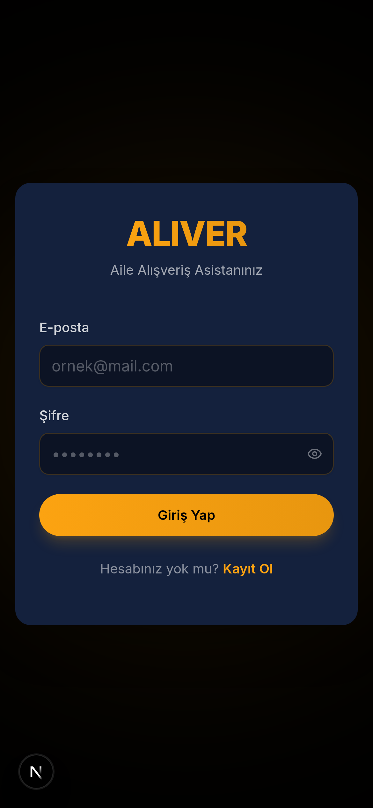
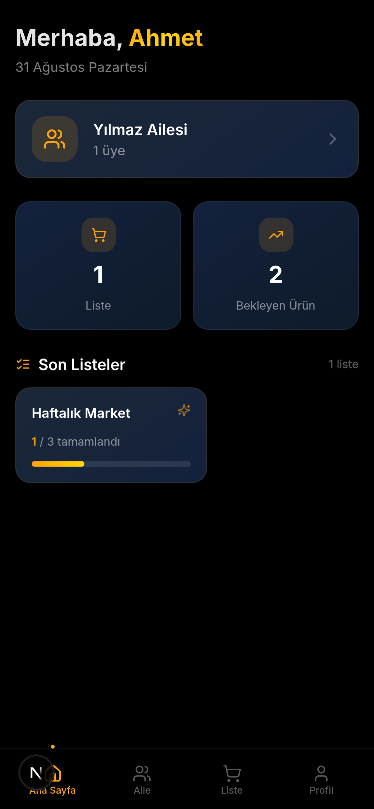
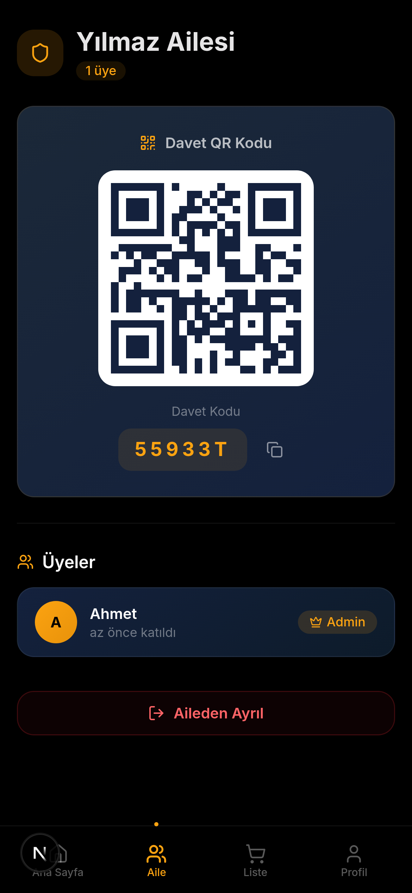
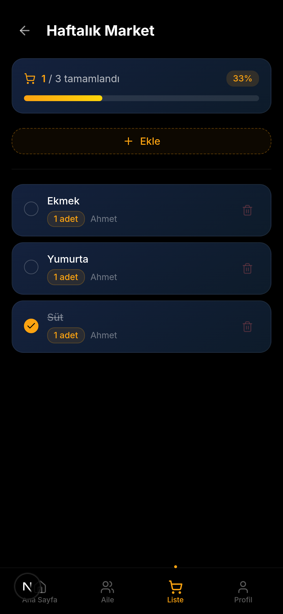
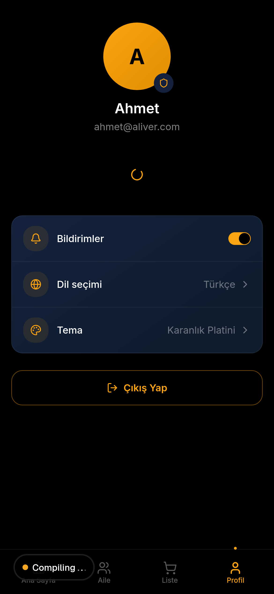

<div align="center">


# A L I V E R

### Aile Alışveriş Asistanınız

**Ailenizle paylaşabileceğiniz akıllı, gerçek zamanlı alışveriş listesi uygulaması.**

[](https://nextjs.org/)
[](https://www.typescriptlang.org/)
[](https://tailwindcss.com/)
[](https://supabase.com/)
[](https://expo.dev/)
[](LICENSE)

---

## 🎯 Neden ALIVER?

Evinizdeki ihtiyaçları tek bir listede toplayın, ailenizdeki herkes anında görsün. 
Biri alışverişi yapsın, diğeri uygulamadan takip etsin. **QR kod ile saniyeler içinde aile üyesi ekleyin.**

```
┌─────────────┐     QR Kod     ┌─────────────┐
│   Anne      │ ────────────► │   Baba      │
│  "Süt al"  │               │  ✓ Süt alındı│
└──────┬──────┘               └─────────────┘
       │
       ▼
┌─────────────┐
│   Çocuk     │
│  "Ekmek"    │
└─────────────┘
```

---

## ✨ Özellikler

| Özellik | Açıklama |
|---------|----------|
| 🔐 **Auth Sistemi** | Kayıt / Giriş ile güvenli kullanıcı yönetimi |
| 👨‍👩‍👧‍👦 **Aile Ağacı** | Aile oluşturun, QR kod ile üye ekleyin |
| 📋 **Alışveriş Listeleri** | Birden fazla liste oluşturun, yönetin |
| 🛒 **Ürün Takibi** | Ürün ekle, miktar belirle, birim seç (adet/kg/litre/paket) |
| ✅ **Tamamlama** | Alınan ürünleri işaretle, herkes görsün |
| 📊 **İlerleme** | Liste ilerleme çubuğu ile durum takibi |
| 📱 **QR Davet** | QR kod okutarak saniyeler içinde aileye katıl |
| 🌙 **Platini Tema** | Siyah & Altın lüks karanlık tema tasarımı |
| 💫 **Animasyonlar** | Framer Motion ile akıcı geçişler |

---

## 📸 Ekran Görüntüleri

<div align="center">
  <table>
    <tr>
      <td></td>
      <td></td>
      <td></td>
    </tr>
    <tr>
      <td align="center">Giriş / Kayıt</td>
      <td align="center">Ana Sayfa</td>
      <td align="center">Aile Yönetimi</td>
    </tr>
    <tr>
      <td></td>
      <td></td>
      <td></td>
    </tr>
    <tr>
      <td align="center">Alışveriş Listesi</td>
      <td align="center">Profil</td>
      <td align="center">ALIVER Logo</td>
    </tr>
  </table>
</div>

---

## 🏗️ Mimari

```
aliver/
├── prisma/
│   └── schema.prisma          # Veritabanı modelleri
├── src/
│   ├── app/
│   │   ├── layout.tsx          # Root layout + tema
│   │   ├── page.tsx            # Ana sayfa (SPA router)
│   │   ├── globals.css         # Platini tema + glass efektleri
│   │   └── api/
│   │       ├── auth/           # Kayıt, Giriş, Token doğrulama
│   │       ├── family/         # Aile CRUD, QR, Üye yönetimi
│   │       └── lists/          # Liste & Ürün CRUD
│   ├── components/
│   │   ├── aliver/             # Uygulama bileşenleri
│   │   │   ├── auth-screen.tsx
│   │   │   ├── home-screen.tsx
│   │   │   ├── family-screen.tsx
│   │   │   ├── list-screen.tsx
│   │   │   ├── profile-screen.tsx
│   │   │   └── bottom-nav.tsx
│   │   └── ui/                 # shadcn/ui bileşenleri
│   ├── store/
│   │   └── auth-store.ts       # Zustand state yönetimi
│   └── lib/
│       ├── auth.ts             # Auth yardımcıları
│       ├── db.ts               # Prisma client
│       └── utils.ts            # Genel yardımcılar
├── supabase-schema.sql         # Supabase SQL şeması
└── package.json
```

---

## 🗄️ Veritabanı Şeması

```
┌──────────┐     ┌──────────────┐     ┌───────────────┐
│   User   │     │    Family    │     │ FamilyMember  │
├──────────┤     ├──────────────┤     ├───────────────┤
│ id       │◄────│ createdBy    │     │ id            │
│ name     │     │ id           │◄────│ familyId      │
│ email    │     │ name         │     │ userId        │──► User
│ password │     │ inviteCode   │     │ role          │
│ avatar   │     │ createdAt    │     │ joinedAt      │
└────┬─────┘     └──────┬───────┘     └───────────────┘
     │                  │
     │                  │
     ▼                  ▼
┌──────────────┐  ┌───────────────┐
│ ShoppingList │  │ ShoppingItem  │
├──────────────┤  ├───────────────┤
│ id           │  │ id            │
│ name         │  │ name          │
│ createdBy ───┼──│ addedBy ──────┼──► User
│ familyId     │  │ listId ───────┼──► ShoppingList
│ createdAt    │  │ quantity      │
└──────────────┘  │ unit          │
                  │ completed     │
                  │ purchasedBy ──┼──► User
                  │ purchasedAt   │
                  └───────────────┘
```

---

## 🚀 Kurulum

### Gereksinimler

- **Node.js** 18+
- **Bun** (önerilen) veya npm

### 1. Projeyi Klonlayın

```bash
git clone https://github.com/KULLANICIADINIZ/aliver.git
cd aliver
```

### 2. Bağımlılıkları Kurun

```bash
bun install
```

### 3. Supabase'i Ayarlayın

1. [Supabase](https://supabase.com) hesabı oluşturun
2. Yeni bir proje oluşturun
3. **SQL Editor**'ü açın ve `supabase-schema.sql` dosyasını yapıştırıp çalıştırın
4. **Project Settings > API**'den `SUPABASE_URL` ve `SUPABASE_ANON_KEY`'i alın

### 4. Ortam Değişkenlerini Ayarlayın

```bash
cp .env.example .env
```

`.env` dosyasını düzenleyin:

```env
# Supabase
NEXT_PUBLIC_SUPABASE_URL=https://xxxxx.supabase.co
NEXT_PUBLIC_SUPABASE_ANON_KEY=eyJhbGciOiJIUzI1NiIs...
SUPABASE_SERVICE_ROLE_KEY=eyJhbGciOiJIUzI1NiIs...
```

### 5. Çalıştırın

```bash
# Geliştirme
bun run dev

# Üretim
bun run build
bun start
```

Uygulama **http://localhost:3000** adresinde çalışacaktır.

---

## 📱 Expo Mobil Uygulama (Planlanan)

ALIVER originally designed for **Expo / React Native**. Web version uses Next.js.

```bash
# Expo kurulumu (yakında)
npx create-expo-app aliver-mobile
cd aliver-mobile
npx expo start
```

---

## 🎨 Tasarım Sistemi

### Renk Paleti - Platini Tema

| Renk | Hex | Kullanım |
|------|-----|----------|
| 🖤 **Siyah** | `#000000` | Ana arka plan |
| ✨ **Altın** | `#FCA311` | Aksan, butonlar, vurgular |
| 🔵 **Lacivert** | `#14213D` | Kart arka planları |
| ⚫ **Koyu Lacivert** | `#0D1B2A` | İkincil yüzeyler |
| ⚪ **Beyaz** | `#FFFFFF` | Ana metin |
| 🔘 **Griden** | `#8899AA` | İkincil metin |
| 🔴 **Kırmızı** | `#FF4444` | Hata, tehlike |

### Glass Efektleri

```css
.glass-card {
  background: rgba(20, 33, 61, 0.6);
  backdrop-filter: blur(20px);
  border: 1px solid rgba(252, 163, 17, 0.08);
}
```

### Teknoloji Yığını

- **Framework**: Next.js 16 (App Router)
- **Dil**: TypeScript 5
- **Styling**: Tailwind CSS 4 + shadcn/ui
- **Animasyon**: Framer Motion
- **State**: Zustand (persist)
- **Database**: Supabase (PostgreSQL)
- **Font**: Outfit (Google Fonts)

---

## 🔮 Gelecek Planları

- [ ] 📱 Expo mobil uygulama
- [ ] 🔔 Push bildirimler (Supabase Realtime)
- [ ] 📷 QR kod okuyucu (kamera ile)
- [ ] 🏷️ Ürün kategorileri
- [ ] 📊 Harcama istatistikleri
- [ ] 🌐 Çoklu dil desteği
- [ ] 🎤 Sesli ürün ekleme
- [ ] 🤖 AI ürün önerisi

---

## 🤝 Katkıda Bulunun

1. Fork yapın
2. Feature branch oluşturun (`git checkout -b feature/amazing`)
3. Commit yapın (`git commit -m 'Add amazing feature'`)
4. Push yapın (`git push origin feature/amazing`)
5. Pull Request açın

---

## 📄 Lisans

MIT License © 2025 ALIVER

---

<div align="center">
  <p>
    <strong style="color: #FCA311;">ALIVER</strong> — Ailenizle, Birlikte, İçin.
  </p>
  <p>
    <sub>Built with ❤️ & Next.js</sub>
  </p>
</div>
